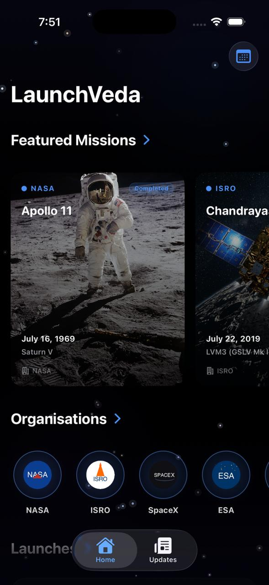
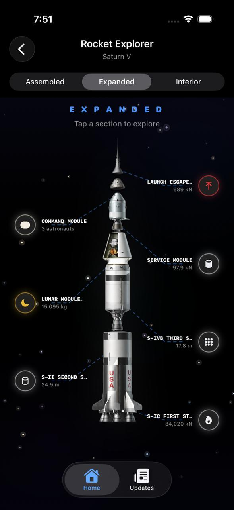
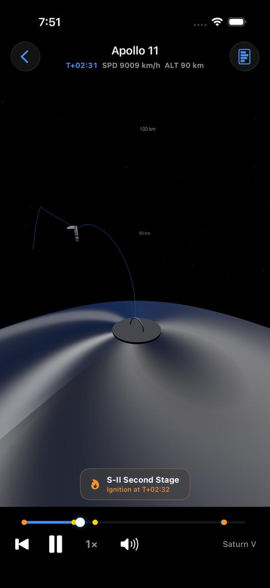

# 🚀 Launch Veda

**Launch Veda** is an educational mobile application designed to help users understand how rocket launches work in a clear and interactive way.  
The app combines launch timelines, rocket anatomy, and mission stages to simplify complex space concepts for students and space enthusiasts.

---

  
  
  

## 🌌 Problem

Understanding rocket launches can be difficult for beginners because information is often scattered across multiple sources such as technical documents, videos, and articles.

As a result, it becomes challenging to:

- Understand the **step-by-step rocket launch sequence**
- Visualize **rocket stages and components**
- Follow events like **stage separation, orbit insertion, and payload deployment**
- Learn the **complete launch process in one structured place**

---

## 💡 Solution

**Launch Veda** solves this problem by presenting rocket launch information in a **simple, structured, and visual format**.

The app allows users to:

- Explore **rocket launch timelines**
- Understand **rocket structure and stages**
- Learn about **key mission events**
- Study **space launch concepts through visual explanations**

---

## ✨ Key Features

- 🚀 **Interactive launch timeline** explaining each stage of a rocket launch  
- 🛰 **Visual representation of rocket stages and components**  
- 📚 **Educational explanations** of launch events and mission phases  
- 🎓 Designed for **students, beginners, and space enthusiasts**

---

## 🛠 Technologies Used

- **Swift / SwiftUI** — iOS application development  
- **Gemini AI** — image generation  
- **ChatGPT** — image refinement and upscaling  
- **Claude AI** — assistance with physics equations and explanations

---

## 🎯 Goal

The goal of **Launch Veda** is to make **space launch education simple, engaging, and accessible** for anyone interested in rocket science and space technology.
